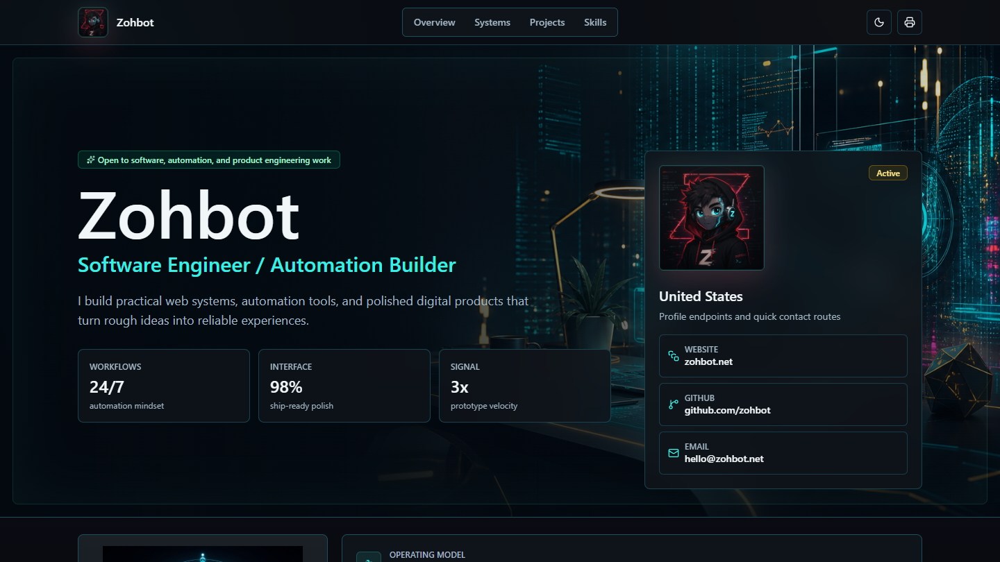

# Zohbot Web Resume

<p align="center">
  
</p>

A clean-room web resume for `zohbot.net`, rebuilt as a Vite + React app with Tailwind CSS, Radix primitives, and local shadcn/ui-style components.

For website, resume, portfolio, or automation project inquiries, visit [SYHTEK](https://syhtek.com).

## Buyer / Customer Notes

This repo demonstrates a modern personal portfolio/resume interface with structured content, project cards, contact routes, print-friendly resume behavior, and a polished responsive visual system. It can be adapted for consultants, technical founders, freelancers, or small agencies that need a credible personal site.

Design direction, frontend implementation, visual system, and GitHub presentation by [SYHTEK](https://syhtek.com).

## Tech Behind The Website

- React and Vite
- Tailwind CSS
- Radix-style local UI components
- Lucide icon system
- Structured resume data in `src/data/resume.js`
- Generated project-owned visual assets
- Print stylesheet for PDF output
- GitHub Pages publishing path through `CNAME`

## Edit Your Resume

Update the content in `src/data/resume.js`. The page renders from that file, so your name, links, roles, projects, education, and skills are all in one place.

## Preview Locally

Install dependencies and run the Vite dev server:

```powershell
npm install
npm run dev -- --port 5174
```

Then visit `http://127.0.0.1:5174`.

## Publish To zohbot.net

This repo includes `CNAME` with:

```text
zohbot.net
```

For GitHub Pages, push this folder to your own repository, enable Pages for the main branch, and point the `zohbot.net` DNS records at GitHub Pages.

## PDF

Use the print button in the upper-right corner, then choose "Save as PDF". The stylesheet includes print-specific rules for a resume-friendly PDF.

## Asset Credit

The hero background and holographic core graphic were generated with the built-in image generation tool for this project. Final project assets:

- `assets/ai-zohbot-hero.png`
- `assets/ai-zohbot-core.png`
- `assets/zohbot-avatar.png`

The current avatar is the project-owned image provided by the site owner in `assets/zohbot-avatar.png`.
